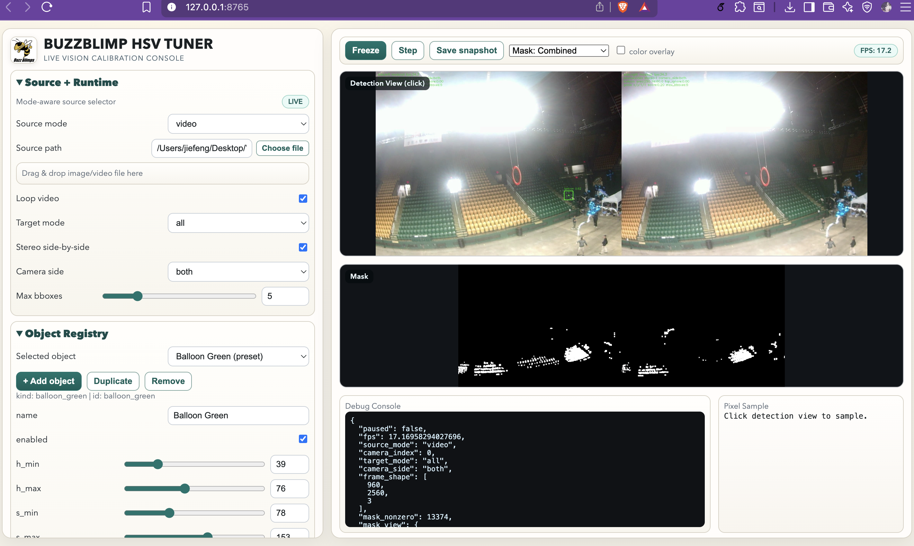

# BUZZBLIMP HSV TUNER
Web UI HSV tuning tool for BuzzBlimps vision pipelines.



## Startup Guide (Linux / macOS)
Conda is recommended.

```bash
conda deactivate
conda create -n HSVTuner python=3.11 -y
conda activate HSVTuner

python3 -m pip install -r requirements.txt
python3 main.py --host 127.0.0.1 --port 8765
```

Later startups:

```bash
python3 main.py
```

## Recommended Use
1. Select the object you want to tune.
2. Choose the mask view mode in the top toolbar (combined, selected object, color overlay).
3. Click points on the detection view and read HSV values from the Pixel Sample panel.
4. Use Freeze / Step to tune on stable frames.
5. Save a profile and export YAML.

## File Structure and Exports
- Exported YAML:
  - `demo/hsv_tuner_workspace/02_webui/exports`
- Saved snapshots:
  - `demo/hsv_tuner_workspace/02_webui/snapshots`
